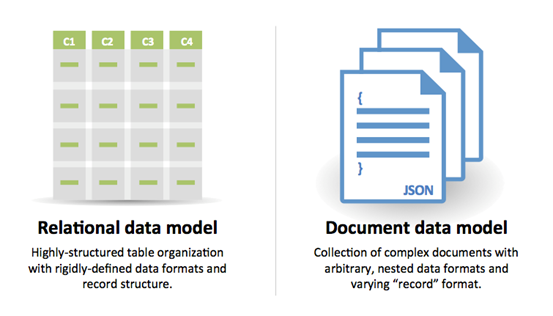
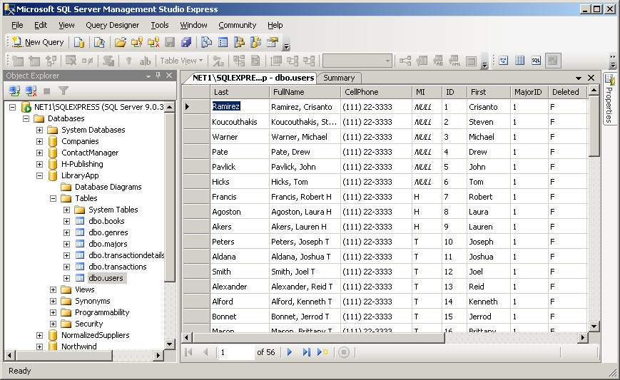
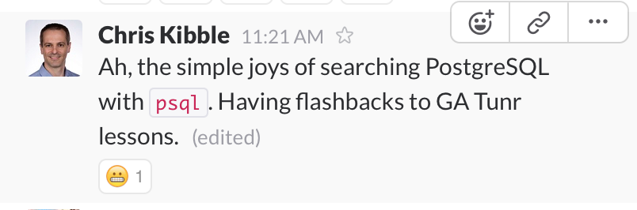

# Databases

## Learning Objectives

**Concepts**
- Explain what a database is and why you would use one
- Explain how a DBMS, a database, and SQL relate to one another
- Describe a database schema and how it relates to tables, rows and columns

**Mechanics**
- Create a new PostgreSQL database
- Set up a PostgreSQL database schema with a saved SQL file
- Seed a PostgreSQL database with a saved SQL file
- Execute basic SQL commands to execute CRUD actions in a database

## Framing



*via [SQL vs. NoSQL- What you need to know](http://dataconomy.com/sql-vs-nosql-need-know/)*

### SQL vs NoSQL comparison

| SQL | NoSQL |
| --- | ----- |
| Since late 1970s | Since late 2000s |
| Relational model | other data storage models |
| Tables (rows and columns) | Documents (js objects) |
| not easy to scale | easier to scale |
| reliability, ACID compliance | no promises :) |
| **Examples** Postgres, MySQL, SQLite | **Examples** MongoDB, Cassandra, Couchbase |


## Enter Databases (5 minutes / 0:40)

Reminder: a database is a tool for storing data. The benefits of using a database include:

**Permanence** - Once we write data to our database, we can be pretty sure it
won't be lost (unless the server catches on fire).

**Speed** - Databases are generally optimized to be fast at retrieving and
updating information. Literally, DBs can be 100,000x faster than
reading from a file.

<!-- AM: Any additional information that can be provided re: speed that would count towards industry experience? -->

**Consistency** - Databases can enforce rules regarding consistency of data,
especially when handling simultaneous requests to update information.

**Scalability** - Databases can lots of requests per second, and many
DBs have ways to scale to massive loads by replicating / syncing information
across multiple DBs.

**Querying** - DBs make it easy to search, sort, filter and combine related
data using a Query Language.

> Note: There's an acronym in computer science [ACID](https://en.wikipedia.org/wiki/ACID),
which is a set of properties that ensure data is reliably stored. You can read
the wiki article for more info but, in short, a lot of the properties mentioned
above make a database ACID-compliant.

## What's a Relational Database? (10 minutes / 0:50)

<!-- AM: Whiteboard a table(s) during this section. -->

The most popular type of database is a **relational** database. How do they work?



*Tabular!*

**Data is stored in tables.**
- These tables are organized by columns and rows, much like a spreadsheet.
- Tables are named according to what they model (e.g., `artists`, `songs`).
- In the case of `artists`, each row represents one artist.
- Each column is called an **attribute** or **field**, such as `id`, `title`,
  `birth_year`.

**Communicate via SQL (Structured Query Language)**
- SQL is a database language used specifically for relational databases.
- This is in contrast to non-relational databases, which we will use later in the course.

**Can relate data between tables**
- Hence the name *relational* database.
- We can relate rows in the `songs` table to rows in the `artists` table.
- We use a `key` to do this, which is a field that is unique for each row in a table.
- The key is often represented using an `id`, which is a unique identifier for each entry in a table.

### Types of Relational Databases

There are lots of relational databases, such as PostgreSQL, MySQL, and SQLite.
They are all similar in that they use SQL, but they do have different features.

MySQL claims to be "the most popular open-source database," while PostgreSQL
claims in response to be "the most advanced open-source database". It's true
that in most tests, Postgres comes out ahead in terms of speed and has many
features MySQL lacks, such as true full-text search and handling geo-data.

If you're interested in pros and cons, check out this [article comparing MySQL,
Postgres, and SQLite](https://www.digitalocean.com/community/tutorials/sqlite-vs-mysql-vs-postgresql-a-comparison-of-relational-database-management-systems).

### Terminology

While this is a bit technical, it's worth clarifying some terminology...

* **Database** - The actual set of data being stored. We may create multiple
  databases on our computer, usually one for each application.
* **Database Language** - The language used to interact with a database. With relational databases, that is SQL.
* **Database Management System** - The software that lets a user interact (query)
  the data in a database. Examples are PostgreSQL, MySQL, MongoDB, etc.
* **Database CLI** - A tool offered by most DBMSs that allows us to query the
  database from the command line. For PostgreSQL, we'll use `psql`.

## Exploring Postgres (15 minutes / 1:05)

Note: We are learning this to be able to read it. We'll look stuff up when we want to write it!

But there have been times GA grads need to use it (4 months later)!


Start by spotlight searching (`command-space`) for Postgres and launching `Postgres.app`. Once you see the elephant in your Mac menu bar, you'll know Postgres is running.

### psql commands

We'll use `psql` as our primary means of interacting with our databases. Later
on we'll use ruby or server-side JS programs to do so in our programs.

Here's a quick demo. Following along is optional.

```sql
help -- show psql general help info
\?   -- help with psql commands
\h   -- help with SQL commands
\l   -- Lists all databases

CREATE DATABASE demodb;

# What changed?
\l

-- What happens if we don't use a semicolon?


\c demodb -- Connect to the database

\d -- Lists all tables

CREATE TABLE pokemon (
  number INT UNIQUE PRIMARY KEY,
  name VARCHAR NOT NULL,
  type VARCHAR NOT NULL,
  description VARCHAR
);

\d

SELECT * FROM pokemon;

-- nothing!


INSERT INTO pokemon (number, name) VALUES (001, 'Bulbasaur');
-- This won't work! Why?


INSERT INTO pokemon (number, name, type) VALUES (001, 'Bulbasaur', 'Grass');
SELECT * FROM pokemon;

-- INSERT worked! Let's add more
INSERT INTO pokemon (number, name, type) VALUES (002, 'Ivysaur', 'Grass');
INSERT INTO pokemon (number, name, type) VALUES (003, 'Venusaur', 'Grass');
INSERT INTO pokemon (number, name, type) VALUES (004, 'Charmander', 'Fire');
INSERT INTO pokemon (number, name, type) VALUES (005, 'Charmeleon', 'Ghost');
INSERT INTO pokemon (number, name, type) VALUES (006, 'Charizard', 'Fire');
INSERT INTO pokemon (number, name, type) VALUES (007, 'Squitle', 'Water');
INSERT INTO pokemon (number, name, type) VALUES (008, 'Wartortle', 'Water');
INSERT INTO pokemon (number, name, type) VALUES (009, 'Blastoise', 'Water');
INSERT INTO pokemon (number, name, type) VALUES (025, 'Pikachu', 'Electric');
--INSERT INTO pokemon VALUES (026, 'Raichu', 'Electric');

SELECT * FROM pokemon;


-- UPDATE
UPDATE pokemon SET type = 'Fire' WHERE number = 5;
-- UPDATE pokemon SET name=...


-- DELETE
DELETE FROM pokemon WHERE name = 'Pikachu';


-- DROP deletes tables and databases
DROP TABLE IF EXISTS pokemon;
DROP DATABASE IF EXISTS demodb;

\q --quit
```

In short...
- Backslash commands (e.g. `\l` ) are commands to navigate psql. These are psql-specific.
- Everything else is SQL. The SQL is what actually interacts with the database.

### SQL Syntax

- All statements end in a semicolon.
- Whitespace doesn't matter.
- Uppercasing!
- Always use single quotes when typing out string values.
- [Ye olde style guide.](http://leshazlewood.com/software-engineering/sql-style-guide/)

## BREAK (10 minutes / 1:15)

## Schema (10 minutes / 1:25)

Every application's database will have one or more tables. You will recall, each table stores information about a particular model (e.g., `artists`, `songs`).

Each table has a **schema**, which defines what columns it has. For each column the schema defines...

- The column's name.
- the column's data type.
- Any constraints for that column.

### Common Data Types

Here are some common data types for SQL DBs. They are all, for the most part, things you've seen before...

- Boolean
- Integer
- Float
- Text / VARCHAR
  - VARCHAR is short, TEXT is long
- NULL
- Date
- Time

> [And many more...](http://www.postgresql.org/docs/9.3/interactive/datatype.html)

### Constraints

Constraints act as limits on the data that can go in a column.
- e.g., `NOT NULL` and `UNIQUE`.

> [And many more...](http://www.postgresql.org/docs/8.1/static/ddl-constraints.html)

### Example: Garnet

[Here's the super scary schema we use in Garnet.](https://github.com/ga-dc/garnet/blob/master/db/schema.rb) 😱

### Defining a Schema

Next we're going to build a schema for a database in a sample application. It can change later on if we need to add / remove tables or columns, but we'll start with something simple.

Instead of typing this into psql, we're going to do so by saving the schema to a `.sql` file and run it, just like we have with `.js` and `.rb` files.

## You Do: Building Our DB (15 minutes / 1:40)

> 10 minutes exercise. 5 minutes review.

1. Clone this
[library SQL Exercise repo](https://github.com/ga-wdi-exercises/library_sql)
2. Open it in atom.
3. Follow along with the directions below, running commands in the terminal.

#### Creating our Database

```bash
$ createdb library
```

Note that this is a command-line utility that ships with Postgres, as an
alternate to using the SQL command `CREATE DATABASE library;` inside `psql`.

#### Inspecting our Schema

Look critically at each line of the provided `schema.sql` file. Here's how one row breaks down...

`id SERIAL PRIMARY KEY`
- `id`: column name, how we will refer to this column
- `SERIAL` is the data type (similar to integer or string).  It's a special datatype for unique identifier columns, which the db auto-increments.
- `PRIMARY KEY`: a special constraint which indicates a unique identifier for each row.

Take a few minutes to research the other rows.

#### Loading our Schema

To load our schema, we need to run our `schema.sql` file via the Terminal...

```bash
$ psql -d library < schema.sql
```

This means: "run the psql program, connect to the database called 'library',
then run the `schema.sql` file in that database".

#### Loading a Seed File

I've provided a sql file that adds sample data into our `library` database.

Load that in so we can practice interacting with our data:

```bash
$ psql -d library < seed.sql
```

<!-- AM: Is this where the "Building Our DB" exercise ends? -->

## Performing CRUD actions with SQL

CRUD stands for the most basic interactions we want to have with any database:
Create, Read, Update and Destroy.

The most common SQL commands correspond to these 4 actions...

* `INSERT` -> Create a row
* `SELECT` -> Read / get information for rows
* `UPDATE` -> Update a row
* `DELETE` -> Destroy a row

First, enter into the library DB...

```bash
$ psql
$ \c library
```

### INSERT

`INSERT` adds a row to a table...

```sql
INSERT INTO authors(name, nationality, birth_year) VALUES ('Adam Bray', 'United States of America', 1985);
```

### SELECT

`SELECT` returns rows from a table...

```sql
-- select all columns from all rows
SELECT * FROM authors;

-- select only some columns, from all rows
SELECT name, birth_year FROM authors;

-- select rows that meet certain criteria
SELECT * FROM authors WHERE name = 'James Baldwin';
```

### UPDATE

`UPDATE` updates values for one or more rows...

```sql
UPDATE authors SET name = 'Adam B.', birth_year = 1986 WHERE name = 'Adam Bray';
```

### DELETE

`DELETE` removes rows from a table...

```sql
DELETE FROM authors WHERE name = 'Adam B.';
```

## Exercise! (20 minutes / 2:00)

Complete the queries in `basic_queries.sql` in the library_sql repo.

## Break (10 minutes / 2:10)
